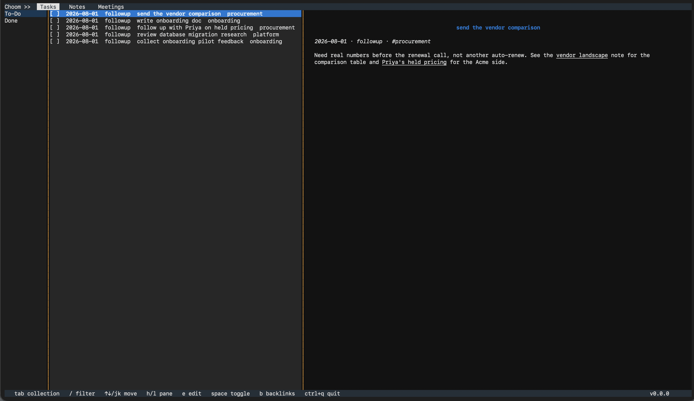
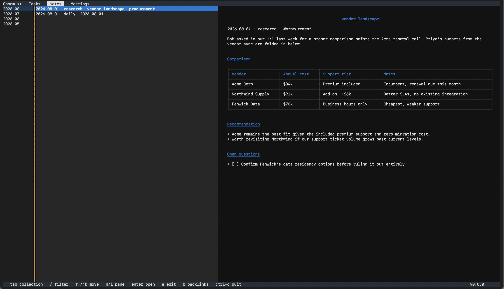
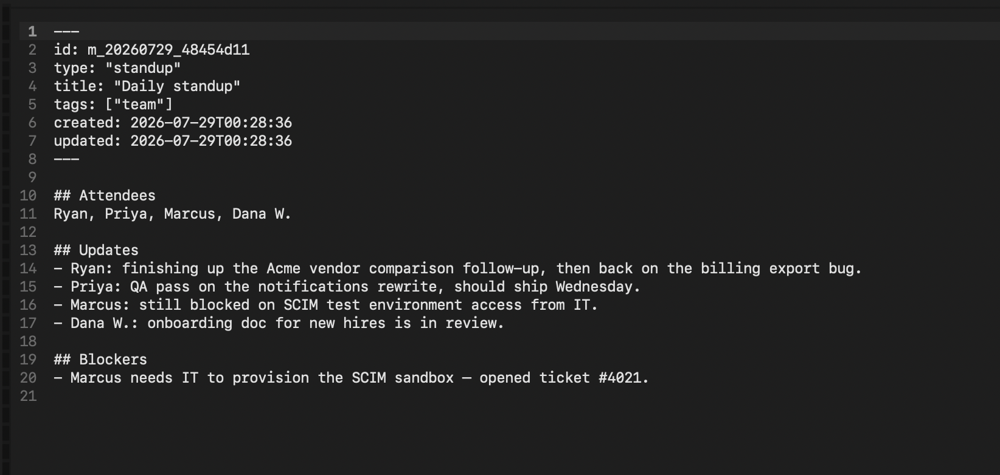
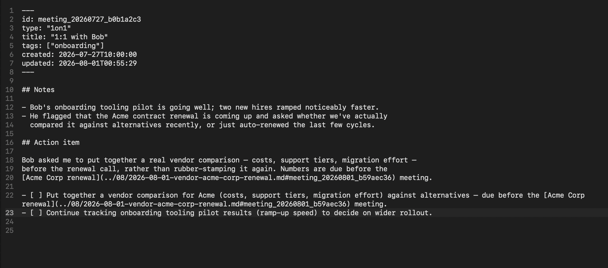
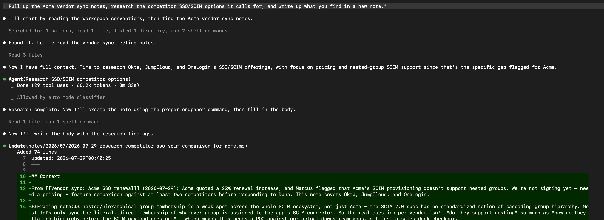
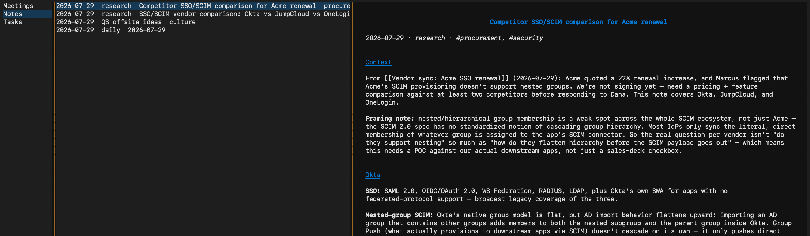

# choom

```
⠀⠀⠀⠀⠀⠀⠀⠀⣀⣀⣤⣤⣤⣤⣤⣄⣀⡀⠀⠀⠀⠀⠀⠀⠀⠀
⠀⠀⠀⠀⢀⣠⣶⣾⡿⠿⢛⣛⣛⣛⡛⠻⠿⣿⣷⣦⡀⠀⠀⠀⠀⠀
⠀⠀⢀⣴⣿⡿⠛⠁⠀⣴⣿⣿⣿⣿⣿⣷⡄⠀⠉⠻⣿⣷⡀⠀⠀⠀
⠀⢀⣾⡿⠋⠀⠀⠀⢸⣿⣿⣿⣿⣿⣿⣿⡧⠀⠀⠀⠈⠻⣿⣦⠀⠀
⢀⣿⡿⢁⣠⣤⣤⣤⣈⢿⣿⣿⣿⣿⣿⣿⠇⣠⣤⣤⣤⣀⠹⣿⣧⠀
⣼⣿⢳⣿⣿⣿⣿⣿⣿⣧⠙⢻⣿⣿⠛⢡⣾⣿⣿⣿⣿⣿⣷⣻⣿⡀
⣿⣿⣿⣿⣿⣿⣿⣿⣿⣿⡇⢸⣿⣿⠀⢸⣿⣿⣿⣿⣿⣿⣿⣿⣿⡇
⣿⣿⠘⣿⣿⣿⣿⣿⣿⣿⡀⢸⣿⣿⠀⣸⣿⣿⣿⣿⣿⣿⡿⢹⣿⡇
⢿⣿⡄⠈⠙⠛⠟⠛⠙⢿⣿⣾⣿⣿⣾⣿⠟⠙⠛⠟⠛⠉⠀⣸⣿⠁
⠈⣿⣷⡀⠀⠀⠀⠀⠀⠀⠙⢿⣿⣿⡟⠃⠀⠀⠀⠀⠀⠀⣰⣿⡟⠀
⠀⠘⢿⣷⣄⠀⠀⠀⠀⠀⠀⢸⣿⣿⠀⠀⠀⠀⠀⠀⢀⣴⣿⠟⠀⠀
⠀⠀⠈⠻⣿⣷⣄⡀⠀⠀⠀⢸⣿⣿⠀⠀⠀⠀⢀⣴⣿⡿⠃⠀⠀⠀
⠀⠀⠀⠀⠈⠙⠿⣿⣷⣶⣤⣼⣛⣻⣤⣤⣶⣾⡿⠟⠋⠀⠀⠀⠀⠀
⠀⠀⠀⠀⠀⠀⠀⠀⠉⠉⠛⠛⠛⠛⠛⠛⠉⠁⠀⠀⠀⠀⠀⠀⠀⠀
KEEP YOUR CORPO OVERLORDS HAPPY, FEED YOUR AI
```

**A corporate-friendly Markdown notes engine that makes your AI happy.**

A *choom* is Night City slang for a good friend — the one who's got your back. That's the job here: keeping you organized and your AI fed with context, corpo restrictions notwithstanding.

A local-only, terminal-based tool for capturing and organizing meeting notes, general notes, and tasks as plain markdown files — structured enough for a human to navigate through a TUI, and legible enough that an AI assistant can search and edit the vault through a CLI without any integration work.

## Why

Markdown is the native format of AI assistants — they read it, write it, diff it, and reason over it without an adapter layer. Almost nobody at a large company can actually work that way, because the sanctioned note-taking tools (OneNote, Confluence, SharePoint) lock notes behind proprietary formats and authenticated APIs, and markdown-first apps like Obsidian or Logseq are rarely on the approved-software list.

choom installs without admin rights, stores nothing outside a directory you already have, and needs no server or account — just a folder.

The tool disappears into the twenty seconds before a meeting starts. You type `/meeting.standup Q3 planning #platform`, a file exists with correct frontmatter and a date-stamped name, and you're typing notes before anyone has finished joining the call. You never decide where a file goes or what to call it.

## Usage

### Install

Requires Python 3.11+. Works on Windows, macOS, and Linux, with no network access needed after install.

```bash
uv tool install choom
```

**Coming from v0.0.1, when this project was called `endpaper`?** Rename the workspace marker directory — `mv .endpaper .choom` from the workspace root — and nothing else about the workspace changes. Ids written under the old `m_`/`n_`/`t_` prefixes keep resolving alongside the new `meeting_`/`note_`/`task_` ones; no existing file is rewritten.

### Create a workspace

**Cloud-synced folder? Pin it to this device first.** choom has no index — every command
reads whichever files are actually present, so a file that is only a cloud placeholder is
invisible to it, and to any assistant reading the folder. Turn off on-demand/online-only
storage for the workspace folder: **OneDrive** → "Always keep on this device"; **Dropbox** →
"Make available offline"; **Google Drive** → "Available offline"; **iCloud Drive** → keep it
downloaded and exclude it from "Optimize Mac Storage" (or it may be evicted later).

```bash
mkdir notes && cd notes
choom init
```

This creates `.choom/config.toml`, `AGENTS.md`, and `meetings/` in the current directory. This directory is now your workspace root — every command below runs from inside it.

### Capture a meeting

```bash
choom meeting new "Q3 planning" --type standup --tag platform
```

Prints the path to the new file: `meetings/2026-07-28-standup-q3-planning.md`, already stamped with frontmatter (`id`, `type`, `title`, `tags`, `created`, `updated`).

### Browse and list

```bash
choom meeting list --json
choom meeting list --type standup --since 2026-07-01
```

Or launch the TUI with no arguments:

```bash
choom
```



choom opens on **Tasks**; `tab`/`shift+tab` cycle the top bar between Tasks, Notes, and Meetings. For Notes and Meetings the left pane lists months, most-recent-first, and only the month on screen is read from disk — a workspace with years of history costs the same to open as an empty one.



`/` opens a permanent command bar — type `filter <term>` (or `f <term>`) to narrow the list live, or `meeting.standup <description>` and hit `enter` to create one, landing straight in the editor. Arrow keys move, `enter` opens the selected record in a rendered markdown preview, `e` drops into a raw editor from either the list or the preview, `b` toggles a pane showing what the record points at and what points back at it, `ctrl+o`/`ctrl+x` save, `esc` backs out. `/help` lists every command and key binding without leaving the screen, and the running version sits in the bottom-right corner.



### Ask an assistant from inside the document

Type `/ai <prompt>` on its own line in the editor and press `enter`:


The document saves, whichever assistant CLI you already have installed runs the prompt, and the reply lands where the command was:



While it works, the line shows `⋯` and the status bar offers `ctrl+c to cancel`. Cancelling — or any failure — restores the line exactly as you typed it, so a prompt is never lost.

### For AI assistants

An assistant working in a choom workspace reads `AGENTS.md` at the root and takes it from there — non-interactive, `--json`-capable, and scriptable by design. Nothing opens an editor or blocks on a prompt.

Below, an assistant is asked to pull up a vendor sync meeting, research the competitor options it calls for, and write up its findings — reading and writing the vault the same way it reads and writes a codebase:



The note it produced shows up like any other — because it is:



Run `choom --help` for the full command reference. The `AGENTS.md` that `init` writes into your workspace documents the folder layout, the frontmatter schema, the task line format, link syntax, and the exit codes.

## Features (v0.0.2)

- **Meeting notes** — `/meeting.standup Q3 planning #platform` creates a dated, frontmatter-tagged file and drops you straight into the editor. Browse with `/meetings` or `tab`; the left pane lists months, most-recent-first; `/filter <term>` (or `/f <term>`) narrows across every month; open with `enter`.
- **General notes** — `/note` opens (or creates) today's daily note; `/note.research vendor landscape #procurement` creates a typed note. Browse with `/notes` or `tab`.
- **Tasks** — `/task.followup send the vendor comparison #procurement` appends a checkbox line to `tasks.md`. `/tasks` or `tab` opens on **To-Do**; `space` toggles a task done, moving it to the **Done** category in the left pane. A task can carry an optional markdown body — details, a running log — stored as indented lines beneath its checkbox line; it renders in the preview pane when the task is highlighted, and `e` opens the editor scoped to just that body. Empty until you type something, and a save that changes nothing writes nothing. `choom task show <id>` prints a task and its body from the CLI; `task list --json` carries `body` on every entry. The file stays hand-editable plain markdown — no database.
- **Inline task capture** — inside any meeting or note, typing `/task <description>` (or `/task.<type> <description>`) on its own line and pressing `enter` captures a task without leaving the editor: the line becomes a checklist item linking to it, `- [ ] [call Terry about the renewal](../../../tasks.md#task_a1b2)`, cursor at its end, nothing else on screen moving. Prefix an existing line with `/task.followup ` to promote its own words into the task instead. That checklist item is a **two-way control surface**, not a copy — tick it and save, or tick the task from the tasks list, and the other side follows; opening a document brings every mirror in it into agreement with `tasks.md` first, so nothing shown is ever stale, with no repair command and no background process. `choom task add "<description>" --link <id>` does the same capture from the command line, and `task done`/`undone --json` report which documents were updated.
- **Document links** — any record can point at any other, as an ordinary markdown link: `See [Q3 planning](../../../meetings/2026/07/2026-07-28-q3-planning.md#meeting_20260728_a1b2c3d4)`. The `#id` fragment is what choom resolves and never changes; the path is derived so the link is clickable in any plain markdown viewer, and it's recomputed whenever the target moves. Write just the fragment — `[Q3 planning](#meeting_20260728_a1b2c3d4)` — and the path fills itself in on the next save; nobody has to count `../`. `b` opens a pane of outbound and inbound links in any preview, `/link <search terms>` inserts a correct link without leaving the editor, and `choom links <id> --direction in` answers what points at a record from the command line. `choom links check` separates **stale** links (fixable) from **dead** ones (need a decision) and `choom links heal` repairs every stale one. Nothing is indexed or cached — inbound links are computed by scanning, measured at 155 ms across 6,000 documents.
- **Workspace init** — `choom init` sets up a workspace (config, `AGENTS.md`, `meetings/`, `notes/daily/`, `tasks.md`) in the current directory. Multi-user shared workspaces are planned but not in v0.0.2 — tracked in [issue #18](https://github.com/rstalets/choom/issues/18).
- **View and edit** — every note or meeting opens in a rendered markdown preview (`enter`), switches to a raw editor (`e`) with line numbers and soft wrap, and saves with `ctrl+o` (stay) or `ctrl+x` (save and return). `esc` discards, but only prompts when there's something to lose. `ctrl+s` is also bound as a save alias, but `ctrl+o` is the canonical key: some terminals treat `ctrl+s` as the legacy XOFF flow-control signal and swallow it before it ever reaches choom. If saves with `ctrl+s` seem to do nothing, run `stty -ixon` in that shell (or use `ctrl+o` instead).
- **AI-friendly CLI** — every TUI action has a non-interactive CLI equivalent backed by the same core library: `--json` on every read command, meaningful exit codes, data on stdout and errors on stderr, nothing that opens an editor or blocks on input. Assistants create records through the commands, so frontmatter and file placement stay correct, then edit the markdown bodies directly like any other file.
- **`/ai` in the editor** — type `/ai <prompt>` on its own line and press `enter`: the document saves, your already-installed Claude Code CLI or GitHub Copilot CLI runs the prompt, and the reply lands where the command was. The line shows `⋯` and the status bar names a random breadcrumb plus `ctrl+c to cancel` while it works; every failure — cancelled, no reply, the assistant errored — restores the line exactly as typed. Which assistant to call is detected automatically when only one is installed, or set explicitly with `choom config assistant <claude|copilot|none>` (CLI) or `/config assistant <value>` (TUI command bar) — a workspace with neither tool installed keeps every other feature unchanged.
- **No index, no database** — the markdown files are the only state. choom globs and parses the workspace in memory on launch; nothing to corrupt, nothing to reindex.
- **`AGENTS.md`** — generated at `init`, under ~100 lines, so an assistant landing in the workspace is productive immediately.

Everything above has landed on `main` as of v0.0.2 — see [Releases](https://github.com/rstalets/choom/releases) for what has been published to PyPI.

## License

See [LICENSE](LICENSE).
